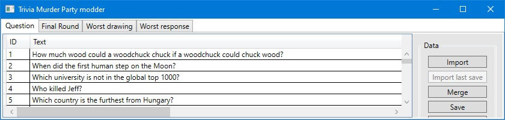

# Trivia Murder Party Modder
Data editor and custom question importer for Trivia Murder Party by Jackbox Games. Easily edit questions, final round tasks, and worst drawings/answers, including question and intro audio. Methods are provided for independent question editing and merging for competitions.

## How to use
### Files
The files used by the game for each category are under `The Jackbox Party Pack 3\games\TriviaDeath\content`. The data functions on the sidebar are:
* **Import**: Loads questions from a file, and overwrites all open questions.
* **Import last save**: Loads the last saved question file.
* **Import**: Loads questions from a file, and appends them at the end of open questions.
* **Save**: Overwrite the opened file with currently open questions.
* **Save As...**: Save currently open questions to a custom file.
* **Release check**: Checks if the question set is compatible with the game (correct IDs, audio files available). If this doesn't show an error, you can play the game with the file that would be saved now.
* **Equalize**: Make answers in different positions equally likely. Fixes the "choose B or the longest" hack you used in high school.

### Trivia Murder Party 2
TMP2 is using the same exact file structures, thus the modes also present in TMP1 can be edited with the Modder. The *Import All* feature looks for TMP1 files, and because of this, it can't be used for TMP2. Instead, the question and final round files have to be manually imported on their respective tabs with the *Import* button. Their files (`TDQuestion.jet` and `TDFinalRound.jet`) are located under `The Jackbox Party Pack 6\games\TriviaDeath2\content`.

### Audio files
It is mandated by the game to have every question and prompt read out loud. It's as simple as hitting record in Audacity and saving it in the game's format (Ogg Vorbis). If Audacity records in stereo, it has to be converted to mono with the "Split stereo to mono" option on the Audio Track's name's dropdown.

To sound like the narrator, apply the following steps before saving. These are not required, but will add a lot to the atmosphere.
* Set a uniform volume by using the following filters:
  * Effect/Amplify: defaults to max volume, that's what we need.
  * Effect/Compressor: just open it and apply, do it multiple times is needed.
* Make your voice low-pitched with the Effect/Change Pitch filters.
  * Set it to -20% for male and -30% for female voice actors.
* Cut off the silent parts, the game has enough delays already.
  * Click and drag along the mostly flat (zero) parts of the waveform, and press Delete.

### Question editor
These are the main questions for the game. The selection is not completely random, the game selects one question from the ones that were shown the longest time ago. To add a new question, just start typing in the empty line when it's selected. The fields are:
* **ID**: The unique identifier of the question (integer). The only requirement is that it must be unique, but the editor warns you at saving if an ID is not unique.
* **Text**: The question itself.
* **Answer 1-4**: Each possible answer. Their order will not be randomized, you can play with what appears after the other.
* **Correct**: The correct answer's number from 1 to 4.

The options available for the currently selected question:
* **Add question audio**: Import an audio file that is the question read out. Must be a mono Vorbis file in OGG container.
* **Add intro audio**: Any speech before the question is shown. Must be a mono Vorbis file in OGG container.
* **Remove intro audio**: Remove the intro audio from this question.
* **Remove**: Delete this question from the question set.

### Final Round editor
The final round consists of topics, each containing correct and incorrect choices. This editor has a tree which shows all topics, and those can be expanded to choices. Use the "Add topic" button to add a new node to the tree. The options for the selected topic are:
* **Add choice**: Add a choice node to the topic and select it.
* **Add in bulk...**: Opens a dialog where you can list multiple correct and incorrect choices. This is a faster way than adding each choice individually and setting them to correct.
* **Add topic audio**: Import an audio file that is the topic read out. Must be a mono Vorbis file in OGG container.
* **ID**: The unique identifier of the topic (integer). The only requirement is that it must be unique, but the editor warns you at saving if an ID is not unique.
* **Topic**: Displayed title of the topic.

The options for the selected choice are:
* **Correct**: Check if the choice is correct for the topic.
* **Answer**: The text for this choice.
* **Remove**: Remove this choice from the topic's possible choices.

### Worst drawing/response editor
These are simple topics that can be answered with a drawing or a short text, and the player with the most votes for the worst answer loses. To add a new option, simply start typing when an empty line is selected. Each option must have a unique integer ID, but this is checked at saving. Each option must also have an audio that reads out the topic, this can be added with the "Import audio" button. This audio must be a mono Vorbis file in OGG container. Options can be individually removed with the "Remove" button.

## Licence
The source code, just like the compiled software, is given to you for free, but without any warranty. It is not guaranteed to work, and the developer is not responsible for any damages from the use of the software. You are allowed to make any modifications, and release them for free under this licence. If you release a modified version, you have to link this repository as its source. You are not allowed to sell any part of the original or the modified version. You are also not allowed to show advertisements in the modified software. If you include these code or any part of the original version in any other project, these terms still apply.
